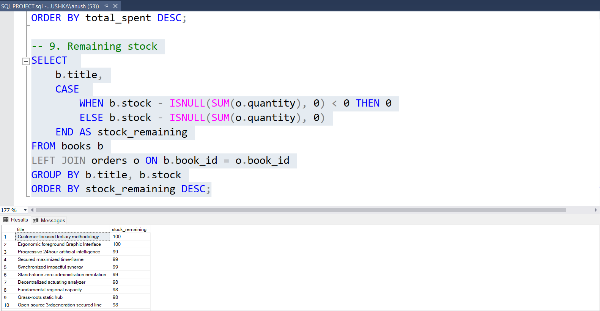

# 📚 Online Book Store SQL Project

## 📖 Overview

This project demonstrates a SQL-based database system for an online bookstore. It includes database creation, data import from CSV files, and analytical queries to generate business insights.

---

## 🗄️ Database Structure

The project consists of three tables:

* **Books** – stores book details (title, author, genre, price, stock)
* **Customers** – contains customer information
* **Orders** – records transactions including quantity and total amount

---

## 🚀 Features

* Database creation using SQL Server
* Data import using BULK INSERT
* Use of primary and foreign keys
* SQL queries for data analysis
* Real-world business questions solved using SQL

---

## 📊 Key Analysis Performed

* Total revenue calculation
* Most frequently ordered books
* Top spending customers
* Genre-wise sales analysis
* Stock availability after orders
* Customer purchase behavior

---

## 🛠️ Tools Used

* SQL Server
* CSV Files

---

## 📂 Dataset
* Source: 
* Source: 
* Source: 

---

## ▶️ How to Run

1. Open SQL Server
2. Run `SQL PROJECT.sql`
3. Ensure CSV files are in correct path or same folder
4. Execute queries to view results

---

## 📸 Output Preview

* Query Result: 

---

## 📎 Author

Anushka Nagare
